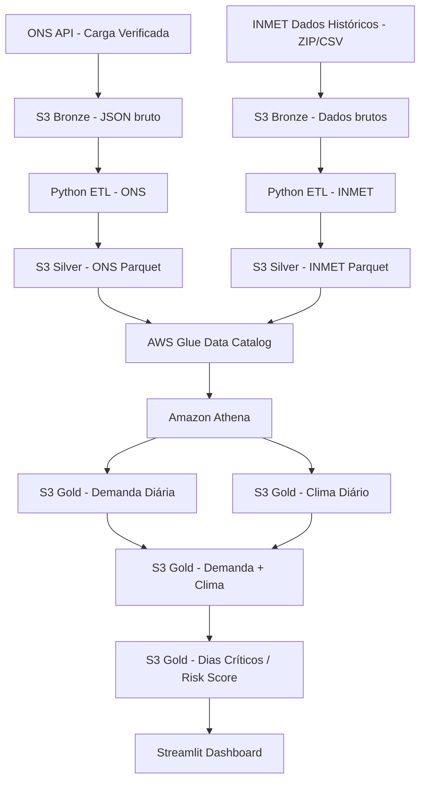
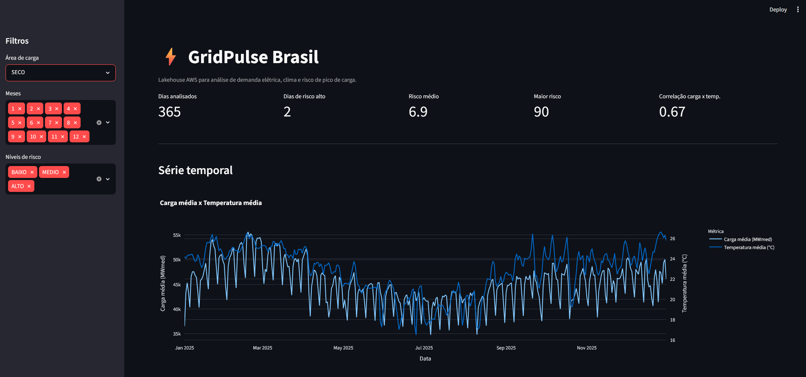
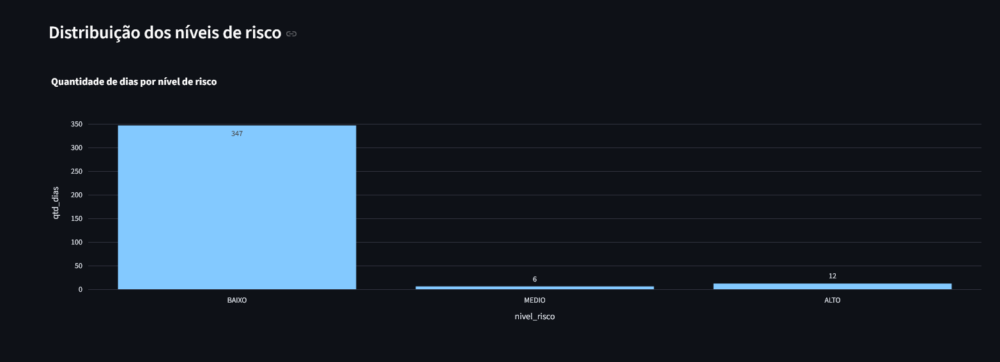
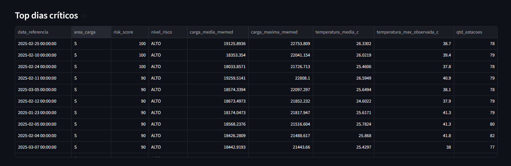
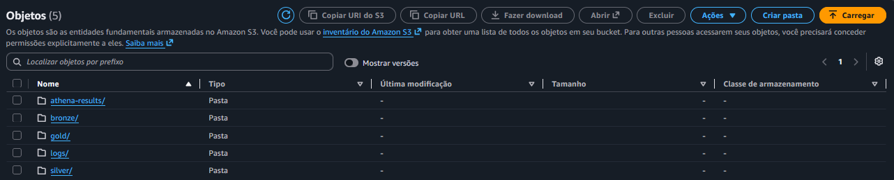
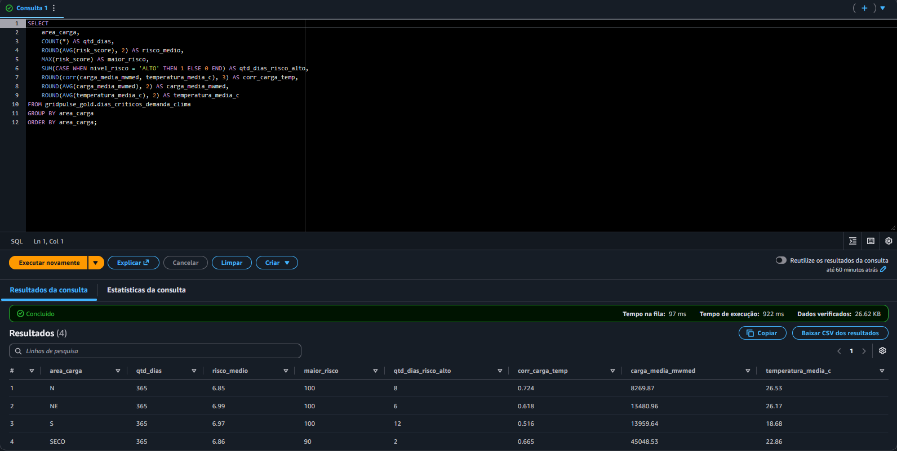

# GridPulse Brasil

Lakehouse serverless na AWS para análise da relação entre demanda elétrica, clima e risco de pico de carga no Brasil.

## Visão geral

O **GridPulse Brasil** é um projeto de Engenharia de Dados que integra dados públicos do **ONS** e do **INMET** em uma arquitetura **Medallion** na AWS.

O projeto constrói um pipeline completo para:

- ingerir dados públicos de energia e clima;
- armazenar dados crus na camada Bronze;
- transformar dados brutos em tabelas limpas na camada Silver;
- materializar tabelas analíticas na camada Gold;
- catalogar dados com AWS Glue Data Catalog;
- consultar dados com Amazon Athena;
- calcular um score de risco de pico de demanda;
- visualizar os resultados em um dashboard Streamlit.

---

## Problema

A demanda elétrica pode variar conforme fatores climáticos, especialmente temperatura. Em dias mais quentes, o uso de refrigeração tende a aumentar, pressionando a carga elétrica.

Este projeto investiga essa relação combinando:

- carga elétrica verificada por área de carga;
- observações climáticas horárias;
- agregações diárias;
- análise de correlação;
- score de risco baseado em percentis de carga e temperatura.

---

## Objetivo

Construir um **lakehouse serverless na AWS** para análise da relação entre clima e demanda elétrica no Brasil, usando dados públicos e boas práticas de Engenharia de Dados.

O projeto demonstra:

- arquitetura Medallion;
- ETL/ELT com Python e SQL;
- particionamento de dados;
- uso de Parquet;
- catálogo de dados com AWS Glue;
- consultas serverless com Athena;
- modelagem de tabelas Gold;
- dashboard analítico;
- controle de custos em ambiente cloud.

---

## Arquitetura



---

## Arquitetura Medallion

O projeto utiliza arquitetura **Medallion**, separando os dados em três camadas principais:

```text
Bronze -> Silver -> Gold
```

### Bronze

A camada Bronze armazena os dados crus, preservando o formato original da fonte.

Exemplos:

- ONS: JSON retornado pela API de carga verificada.
- INMET: ZIP/CSV histórico das estações automáticas.

Objetivos da Bronze:

- preservar rastreabilidade;
- manter uma cópia fiel da fonte;
- evitar perda precoce de informação;
- permitir reprocessamento futuro;
- manter histórico de ingestões.

---

### Silver

A camada Silver contém dados limpos, padronizados, tipados e deduplicados.

Transformações aplicadas:

- padronização de nomes de colunas;
- conversão de datas e timestamps;
- conversão de valores numéricos;
- tratamento de vírgula decimal em dados do INMET;
- remoção de duplicatas;
- validação de colunas críticas;
- enriquecimento com metadados;
- particionamento por área, UF, ano e mês;
- gravação em Parquet.

---

### Gold

A camada Gold contém tabelas analíticas prontas para consumo por SQL, BI e dashboard.

Tabelas Gold criadas:

| Tabela | Descrição |
|---|---|
| `demanda_diaria_area` | Demanda elétrica agregada por área de carga e dia |
| `clima_diario_area` | Dados climáticos agregados por área de carga e dia |
| `demanda_clima_diaria` | Integração entre demanda elétrica e clima |
| `dias_criticos_demanda_clima` | Score de risco diário de pico de demanda |

---

## Stack utilizada

- Python
- Pandas
- Boto3
- PyArrow
- AWS S3
- AWS Glue Data Catalog
- AWS Glue Crawler
- Amazon Athena
- Parquet
- Streamlit
- Plotly
- Git/GitHub

---

## Infraestrutura AWS

| Serviço | Papel no projeto |
|---|---|
| Amazon S3 | Armazenamento das camadas Bronze, Silver e Gold |
| AWS Glue Data Catalog | Catálogo de metadados das tabelas |
| AWS Glue Crawler | Descoberta automática de schemas e partições |
| Amazon Athena | Consulta SQL serverless sobre dados no S3 |
| IAM | Controle de permissões para ingestão, consulta e dashboard |

---

## ETL / ELT

O pipeline combina práticas de **ETL** e **ELT**.

### Extract

Extração dos dados das fontes públicas:

- API do ONS;
- arquivos históricos do INMET.

### Load

Carregamento dos dados crus na camada Bronze do S3.

### Transform

Transformações em duas etapas:

1. Python transforma Bronze em Silver.
2. Athena SQL transforma Silver em Gold.

Fluxo principal:

```text
Extract:
    ONS API
    INMET historical files

Load:
    S3 Bronze

Transform:
    Bronze -> Silver with Python
    Silver -> Gold with Athena SQL

Serve:
    Streamlit dashboard
```

---

## Dashboard

O dashboard em Streamlit permite visualizar:

- filtros por área de carga;
- filtros por mês;
- filtros por nível de risco;
- KPIs de dias analisados;
- risco médio;
- maior risco;
- correlação entre carga e temperatura;
- série temporal de carga média x temperatura média;
- distribuição dos níveis de risco;
- resumo mensal;
- ranking dos dias mais críticos.

---

## Áreas analisadas

O projeto analisa as quatro áreas de carga:

| Área | Descrição |
|---|---|
| `SECO` | Sudeste/Centro-Oeste |
| `S` | Sul |
| `NE` | Nordeste |
| `N` | Norte |

O mapeamento entre estações climáticas do INMET e áreas de carga do ONS é feito por UF, como aproximação analítica regional.

---

## Score de risco

A tabela `dias_criticos_demanda_clima` calcula um score de risco diário entre 0 e 100.

O score considera:

- carga média acima do percentil 95 da área;
- carga máxima acima do percentil 95 da área;
- temperatura média acima do percentil 90 da área;
- temperatura máxima acima do percentil 90 da área;
- amplitude de carga acima do percentil 90 da área;
- combinação de pico de carga com temperatura elevada.

## Principais resultados

A análise foi executada para as quatro áreas de carga do sistema elétrico brasileiro em 2025.

| Área | Dias analisados | Risco médio | Maior risco | Dias de risco alto | Correlação carga x temperatura | Carga média (MWmed) | Temperatura média (°C) |
|---|---:|---:|---:|---:|---:|---:|---:|
| N | 365 | 6.85 | 100 | 8 | 0.724 | 8269.87 | 26.53 |
| NE | 365 | 6.99 | 100 | 6 | 0.618 | 13480.96 | 26.17 |
| S | 365 | 6.97 | 100 | 12 | 0.516 | 13959.64 | 18.68 |
| SECO | 365 | 6.86 | 100 | 2 | 0.665 | 45048.53 | 22.86 |

### Interpretação

O score de risco foi calculado separadamente por área de carga, usando percentis internos de cada região. Por isso, um dia classificado como risco alto representa um comportamento extremo em relação ao histórico da própria área, e não necessariamente a maior carga absoluta do país.

A correlação entre carga e temperatura é uma métrica exploratória. Ela indica associação linear entre as variáveis, mas não deve ser interpretada como causalidade direta.

### Classificação

| Score | Nível |
|---:|---|
| 0 a 39 | BAIXO |
| 40 a 69 | MEDIO |
| 70 a 100 | ALTO |

O score é calculado individualmente por área de carga. Assim, um dia de risco alto representa um dia extremo em relação ao histórico daquela própria área.

---

## Como executar localmente

### 1. Criar ambiente virtual

```bash
python -m venv .venv
```

### 2. Ativar ambiente virtual no Windows

```bash
.venv\Scripts\activate
```

### 3. Instalar dependências

```bash
pip install -r requirements.txt
```

### 4. Configurar `.env`

Crie um arquivo `.env` baseado em `.env.example`:

```env
AWS_PROFILE=gridpulse-dev
AWS_REGION=us-east-1
S3_BUCKET=your-bucket-name
ATHENA_DATABASE=gridpulse_gold
ATHENA_OUTPUT_LOCATION=s3://your-bucket-name/athena-results/
```

### 5. Executar dashboard

```bash
streamlit run dashboard/app.py
```

---

## Estrutura do projeto

```text
gridpulse-brasil/
├── dashboard/
│   └── app.py
├── docs/
│   ├── architecture.md
│   ├── etl_pipeline.md
│   ├── data_dictionary.md
│   ├── cost_control.md
│   └── analytics_methodology.md
├── sql/
│   ├── gold/
│   └── validation/
├── src/
│   ├── ingestion/
│   └── transformation/
├── .env.example
├── .gitignore
├── README.md
└── requirements.txt
```

---

## Limitações

- O mapeamento entre estações climáticas e áreas de carga é feito por UF, como aproximação regional.
- O score de risco é baseado em regras estatísticas explicáveis, não em modelo supervisionado.
- A análise de correlação é exploratória e não implica causalidade.
- O dashboard local depende de credenciais AWS configuradas no ambiente.
- A infraestrutura ainda não está provisionada com Terraform.

---

## Próximos passos

- Criar infraestrutura como código com Terraform.
- Adicionar testes automatizados de qualidade dos dados.
- Criar pipeline orquestrado.
- Melhorar o dashboard com insights automáticos.
- Adicionar análise multi-ano.
- Criar versão pública demonstrativa com dados amostrados.

## Screenshots

### Dashboard principal



### Distribuição dos níveis de risco



### Top dias críticos



### Camadas Medallion no S3



### Consulta das tabelas Gold no Athena

