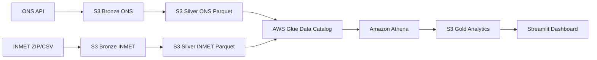

# Arquitetura do GridPulse Brasil

## Objetivo arquitetural

O **GridPulse Brasil** foi desenhado como um lakehouse serverless na AWS para integrar dados públicos de energia e clima.

A arquitetura prioriza:

- baixo custo operacional;
- separação clara entre dados crus, limpos e analíticos;
- uso de formatos colunares;
- consulta SQL serverless;
- rastreabilidade;
- reprodutibilidade;
- facilidade de extensão.

---

## Visão macro da arquitetura



---

## Camadas da arquitetura Medallion

### 1. Bronze

A camada Bronze armazena os dados no formato mais próximo possível da fonte.

No projeto:

- ONS: arquivos JSON da API de carga verificada.
- INMET: pacote histórico anual em ZIP/CSV.

A Bronze não é otimizada para consulta. Ela existe principalmente para:

- auditoria;
- rastreabilidade;
- reprocessamento;
- preservação do dado original.

Exemplo de estrutura:

```text
bronze/
├── ons/
│   └── carga_verificada/
└── inmet/
    └── dados_historicos/
```

---

### 2. Silver

A camada Silver transforma o dado bruto em uma estrutura confiável.

No projeto, a Silver é gravada em Parquet e particionada.

Exemplos:

```text
silver/ons/carga_verificada/area_carga=SECO/ano=2025/mes=01/
silver/inmet/observacoes_horarias/area_carga=SECO/uf=RJ/ano=2025/mes=01/
```

Transformações principais:

- conversão de datas;
- conversão de números;
- normalização de colunas;
- remoção de duplicatas;
- filtragem de registros inválidos;
- inclusão de metadados de origem;
- particionamento para otimização de consultas.

---

### 3. Gold

A camada Gold contém tabelas orientadas a análise.

Tabelas Gold:

| Tabela | Descrição |
|---|---|
| `demanda_diaria_area` | Demanda elétrica agregada por área e dia |
| `clima_diario_area` | Clima agregado por área e dia |
| `demanda_clima_diaria` | Tabela integrada de demanda e clima |
| `dias_criticos_demanda_clima` | Score de risco diário |

A Gold é a camada consumida pelo dashboard e pelas análises finais.

---

## Infraestrutura AWS

### Amazon S3

O S3 é usado como camada de armazenamento central.

Estrutura principal:

```text
s3://bucket/
├── bronze/
├── silver/
├── gold/
├── athena-results/
└── logs/
```

Responsabilidades:

- armazenar dados crus;
- armazenar dados processados;
- armazenar tabelas analíticas;
- armazenar resultados de queries Athena.

---

### AWS Glue Data Catalog

O Glue Data Catalog funciona como catálogo central de metadados.

Ele armazena:

- nome das tabelas;
- localização no S3;
- schema;
- tipos das colunas;
- partições;
- formato dos arquivos.

---

### AWS Glue Crawler

Os crawlers leem os arquivos no S3 e atualizam o Glue Data Catalog.

No projeto, são usados para catalogar:

- Silver ONS;
- Silver INMET.

---

### Amazon Athena

O Athena consulta os dados no S3 usando SQL.

No projeto, ele é usado para:

- consultar dados Silver;
- validar dados processados;
- criar tabelas Gold com CTAS;
- servir dados para o dashboard Streamlit.

---

### IAM

O IAM controla as permissões dos usuários e serviços.

Permissões usadas no projeto:

- leitura e escrita no S3;
- execução de queries Athena;
- leitura do Glue Data Catalog;
- escrita no prefixo `athena-results/`.

---

## Decisões técnicas

### Por que S3?

O S3 permite armazenar dados em diferentes camadas, formatos e prefixos, sem acoplar armazenamento e processamento.

### Por que Parquet?

Parquet é um formato colunar. Ele reduz leitura desnecessária em consultas analíticas, principalmente quando combinado com particionamento.

### Por que Athena?

Athena permite consultar dados no S3 sem provisionar servidores ou clusters. Isso é adequado para um projeto de portfólio com foco em baixo custo.

### Por que Glue?

Glue fornece o catálogo necessário para o Athena entender arquivos no S3 como tabelas SQL.

### Por que Streamlit?

Streamlit permite construir um dashboard analítico com Python, sem necessidade de frontend complexo.

---

## Mapeamento climático para áreas de carga

O INMET trabalha com estações meteorológicas e UFs. O ONS trabalha com áreas de carga.

Para integrar as fontes, foi criado um mapeamento aproximado por UF:

| Área de carga | UFs |
|---|---|
| SECO | RJ, SP, MG, ES, GO, MT, MS, DF |
| S | PR, SC, RS |
| NE | BA, SE, AL, PE, PB, RN, CE, PI, MA |
| N | AM, RR, AP, PA, TO, RO, AC |

Esse mapeamento é uma aproximação geográfica para fins analíticos.